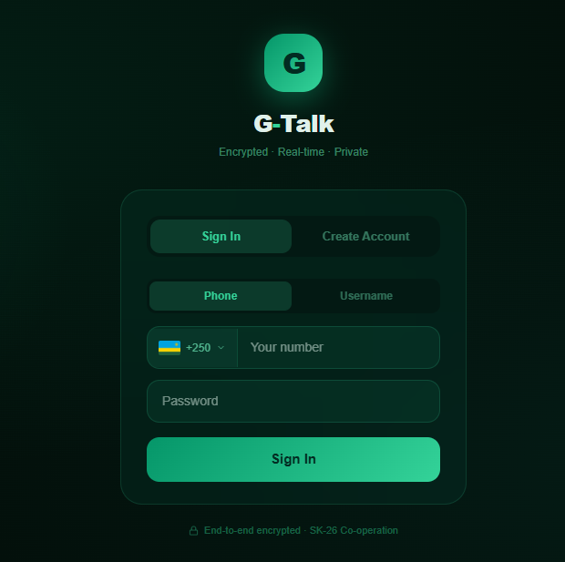
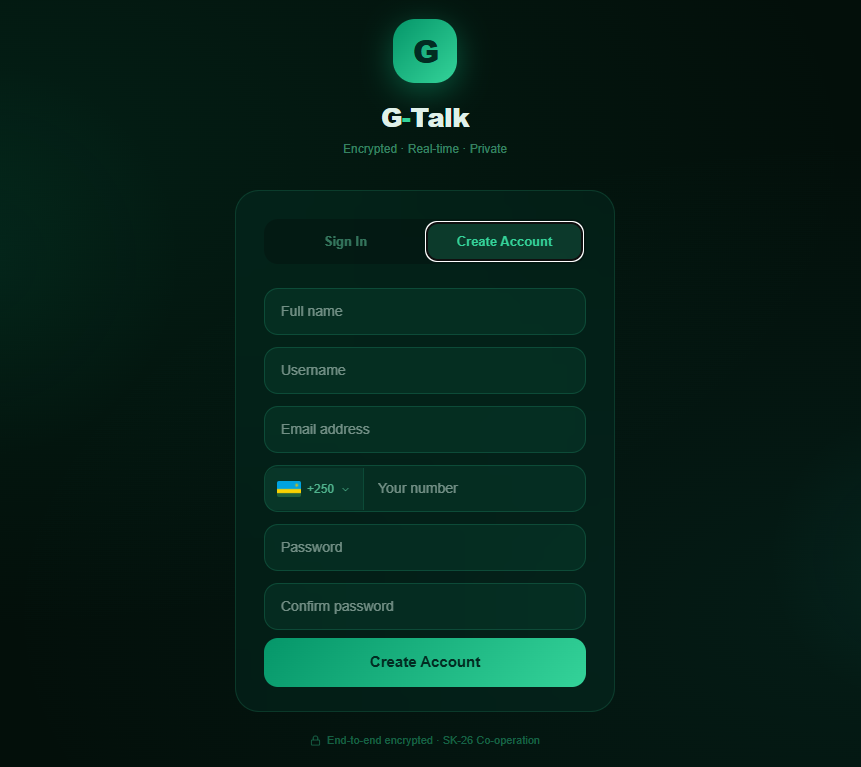
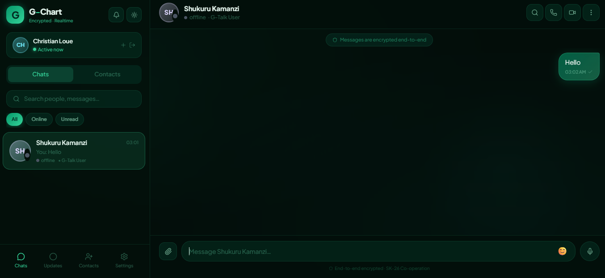
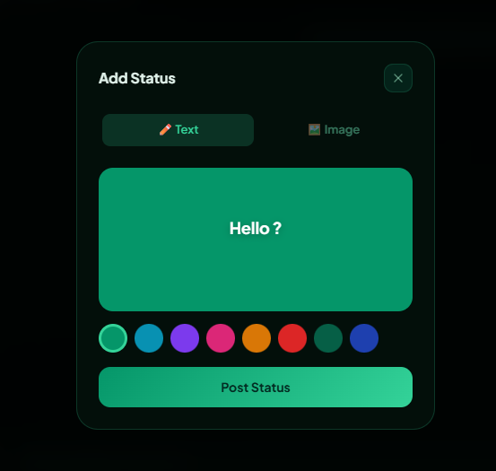
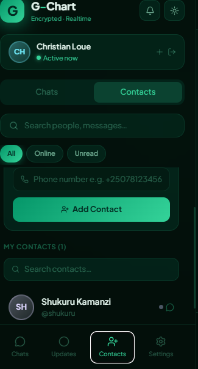
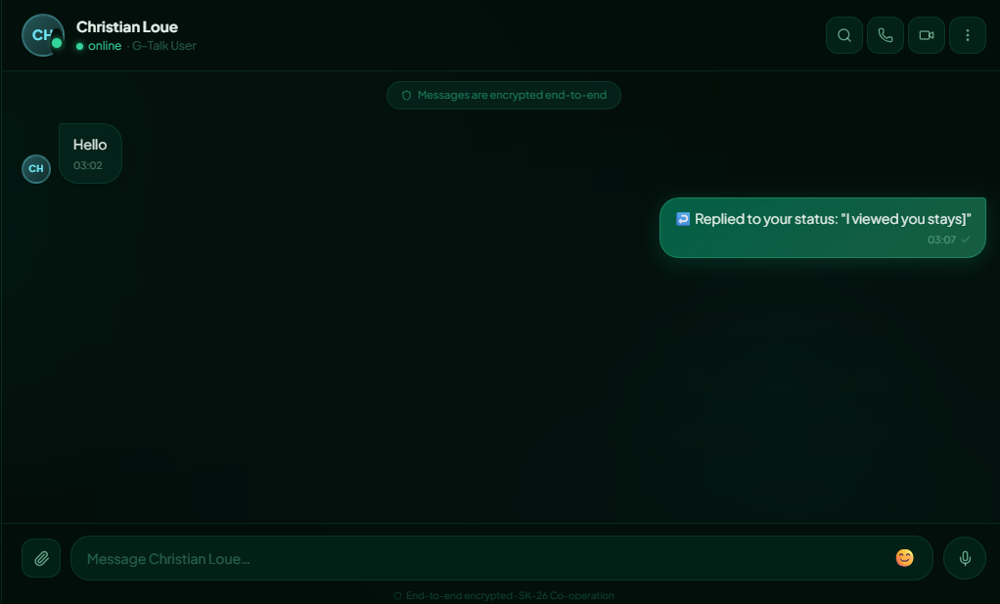

# 🟢 G-Talk — Encrypted Real-Time Chat Application

<div align="center">


**A WhatsApp-inspired real-time encrypted chat application built with React + FastAPI**

[Features](#-features) • [Tech Stack](#-tech-stack) • [Getting Started](#-getting-started) • [API Reference](#-api-reference) • [Project Structure](#-project-structure)

</div>

---

## 📖 Overview

G-Talk is a full-stack real-time chat application inspired by WhatsApp. It features end-to-end message encryption, real-time messaging via WebSockets, contact management, file sharing, voice notes, and status updates. Built as a demo using a JSON file as a lightweight database, it is designed to be easily migrated to a full SQL database in the future.

---

## 📸 Screenshots

### Login


### Register


### Chat Interface


### Add Status


### Status View


### Contacts


### statusReply


### FileAttachment


## ✨ Features

### 🔐 Authentication
- **User Registration** — Full name, username, email, phone number with country code selector, and password
- **User Login** — Sign in with phone number or username
- **Country Code Selector** — Fetches all world countries with real flag images via REST Countries API, searchable dropdown
- **Password Hashing** — Passwords are hashed with SHA-256 before storage, never stored in plain text
- **Session Persistence** — Login session persists across page refreshes via `sessionStorage`
- **Secure Logout** — Clears session and marks user as offline

### 💬 Real-Time Messaging
- **WebSocket Connection** — Persistent WebSocket connection per user for instant message delivery
- **Auto Reconnect** — WebSocket automatically reconnects if connection drops
- **Message Encryption** — All messages encrypted with Fernet symmetric encryption before storage in database
- **Optimistic UI** — Messages appear instantly on sender's side without waiting for server
- **Typing Indicator** — Real-time typing indicator when the other user is typing
- **Message Status Ticks** — Single grey tick (sent), double grey tick (delivered), double green tick (seen)
- **Emoji Reactions** — React to any message with emoji picker
- **Message Search** — Search through messages within a conversation

### 📎 File Sharing
- **Image Sharing** — Send JPG, PNG, GIF, WebP images with thumbnail preview
- **Document Sharing** — Send PDF and Word documents with file type icon and size
- **Video Sharing** — Send MP4, WebM, QuickTime videos with inline player
- **Lightbox Viewer** — Click any image to open full-screen lightbox with download button
- **10MB File Limit** — Enforced on both frontend and backend
- **Real-Time File Delivery** — Files arrive instantly via WebSocket to the recipient

### 🎤 Voice Notes
- **Hold to Record** — Hold mic button to record, release to send (just like WhatsApp)
- **Auto Format Detection** — Supports `audio/webm` and `audio/ogg` depending on browser
- **Real Audio Playback** — Play received voice notes directly in the chat bubble
- **Recording Timer** — Live timer shows recording duration while holding
- **Max Duration** — Auto stops at 2 minutes
- **Send Indicator** — Uploading spinner while voice note is being sent

### 👥 Contact Management
- **WhatsApp-Style Contacts** — Only see users who you have added as contacts
- **Phone Verification** — When adding a contact, G-Talk checks if that phone number is registered
- **Instant Add** — Contact appears in your chat list immediately after adding
- **Contacts Tab** — Dedicated contacts panel showing all your contacts with username and status
- **Click to Chat** — Click any contact in the contacts tab to jump straight to their conversation
- **Search Contacts** — Search contacts by name or username

### 👁️ Status Updates
- **Text Statuses** — Post text statuses with 8 custom background colors
- **Image Statuses** — Post image statuses with optional caption
- **24-Hour Expiry** — Statuses automatically expire after 24 hours
- **Status Viewer** — Full-screen status viewer with auto-progress bar
- **Multiple Statuses** — Multiple statuses per user shown as a sequence
- **View Count** — See how many people viewed your status
- **Viewers List** — Click view count to see exactly who viewed your status by name
- **Status Reply** — Reply to a contact's status which sends a message directly to their chat
- **Unread Indicator** — Green ring around contact avatar for unseen statuses
- **Updates Tab** — Dedicated tab in the sidebar for browsing all status updates

### 🎨 UI & Experience
- **Dark / Light Mode** — Toggle between dark and light themes
- **Glassmorphism Design** — Beautiful frosted glass UI with green ambient glow
- **Mobile Responsive** — Full mobile support with back navigation between chat list and chat view
- **Animated Transitions** — Smooth fadeIn, slideUp, and bounce animations throughout
- **Profile Panel** — Slide-in profile panel showing user details, media grid, and action buttons
- **Scroll to Bottom** — Floating button appears when scrolled up in a long conversation
- **Ambient Orbs** — Decorative animated background orbs for visual depth
- **Custom Scrollbar** — Minimal styled scrollbar matching the app theme
- **Online/Away/Offline Status** — Real-time status dots with glow effect for online users

---

## 🛠 Tech Stack

### Frontend
| Technology | Purpose |
|---|---|
| **React 18** | UI framework with hooks |
| **Vite** | Build tool and dev server |
| **Lucide React** | Icon library |
| **WebSockets API** | Real-time communication |
| **MediaRecorder API** | Voice note recording |
| **REST Countries API** | Country codes and flag images |
| **flagcdn.com** | Country flag images CDN |
| **sessionStorage** | Login session persistence |

### Backend
| Technology | Purpose |
|---|---|
| **FastAPI** | Python web framework |
| **Uvicorn** | ASGI server |
| **WebSockets** | Real-time bidirectional communication |
| **Fernet (cryptography)** | Symmetric message encryption |
| **python-multipart** | File upload handling |
| **SHA-256 (hashlib)** | Password hashing |
| **data.json** | Lightweight JSON file database |
| **StaticFiles** | Serving uploaded files |

---

## 🚀 Getting Started

### Prerequisites
- Node.js 18+
- Python 3.9+
- pnpm or npm

### 1. Clone the repository

```bash
git clone https://github.com/YOUR_USERNAME/gtalk.git
cd gtalk
```

### 2. Backend Setup

```bash
cd backend
pip install -r requirements.txt
```

Generate your Fernet encryption key (do this once):

```bash
python -c "from cryptography.fernet import Fernet; print(Fernet.generate_key().decode())"
```

Copy the output and paste it into `main.py`:

```python
FERNET_KEY = os.getenv("FERNET_KEY", "YOUR_GENERATED_KEY_HERE").encode()
```

Start the backend:

```bash
python main.py
```

Backend runs at `http://localhost:8000`

### 3. Frontend Setup

```bash
cd ui
pnpm install
pnpm run dev
```

Frontend runs at `http://localhost:5173`

### 4. Test with two users

1. Open **Chrome** normally → Register and log in as **User A**
2. Open **Incognito window** → Register and log in as **User B**
3. On User A — go to **Contacts tab** → add User B's phone number
4. User B appears in User A's chat list → start chatting in real time!

---

## 📁 Project Structure

```
gtalk/
├── backend/
│   ├── main.py              # FastAPI application, all endpoints and WebSocket
│   ├── data.json            # JSON file database (auto-created on first run)
│   ├── uploads/             # Uploaded files storage (images, docs, voice notes)
│   ├── requirements.txt     # Python dependencies
│   └── render.yaml          # Render deployment config
│
└── ui/
    ├── src/
    │   └── GreenTalk.jsx    # Main React application (single file)
    ├── .env                 # Environment variables
    ├── index.html
    ├── vite.config.js
    └── package.json
```

---

## 🔌 API Reference

### Authentication
| Method | Endpoint | Description |
|---|---|---|
| `POST` | `/api/register` | Register a new user |
| `POST` | `/api/login` | Login with phone or username |
| `POST` | `/api/logout/{user_id}` | Logout and mark offline |

### Contacts
| Method | Endpoint | Description |
|---|---|---|
| `GET` | `/api/contacts/{user_id}` | Get all contacts for a user |
| `POST` | `/api/contacts/add` | Add contact by phone number |

### Messages
| Method | Endpoint | Description |
|---|---|---|
| `GET` | `/api/messages/{user_id}/{other_id}` | Get conversation messages (decrypted) |
| `POST` | `/api/send/{other_id}` | Send a text message |
| `POST` | `/api/messages/{user_id}/{other_id}/seen` | Mark messages as seen |
| `POST` | `/api/react/{msg_id}` | Add or remove emoji reaction |

### Files
| Method | Endpoint | Description |
|---|---|---|
| `POST` | `/api/upload/{other_id}` | Upload image, video, document, or voice note |
| `GET` | `/uploads/{filename}` | Serve uploaded file |

### Status
| Method | Endpoint | Description |
|---|---|---|
| `POST` | `/api/status` | Post a new text or image status |
| `GET` | `/api/statuses/{user_id}` | Get statuses from all contacts |
| `POST` | `/api/status/{status_id}/view` | Mark a status as viewed |
| `GET` | `/api/status/{status_id}/viewers` | Get list of users who viewed a status |
| `DELETE` | `/api/status/{status_id}` | Delete a status |

### WebSocket
| Event | Direction | Description |
|---|---|---|
| `new_message` | Server → Client | New message received |
| `typing` | Bidirectional | Typing indicator |
| `message_seen` | Client → Server | Notify messages were read |
| `messages_seen` | Server → Client | Ticks update to seen |
| `user_offline` | Server → Client | User disconnected |

WebSocket endpoint: `ws://localhost:8000/ws/{user_id}`

---

## 🔒 Security

- **Message Encryption** — All messages encrypted with Fernet before writing to `data.json`. Plain text never stored on disk
- **Password Hashing** — Passwords hashed with SHA-256. Never stored or returned in plain text
- **CORS Protection** — Backend only accepts requests from whitelisted origins
- **File Type Validation** — Uploaded files validated by MIME type on the backend
- **File Size Limit** — 10MB maximum enforced server-side

---

## ⚠️ Current Limitations (Demo Version)

- **JSON Database** — `data.json` is used as a lightweight demo database. Not suitable for production scale. Planned migration to SQLite/PostgreSQL
- **Ephemeral Storage on Render** — Free tier Render instances reset file storage on restart. Uploaded files and data may be lost on inactivity
- **No End-to-End Encryption** — Messages are encrypted at rest on the server (server-side encryption). True E2E encryption (where only the two users hold keys) is not yet implemented
- **Single Server WebSocket** — WebSockets work on a single server instance. Horizontal scaling requires Redis pub/sub

---

## 🗺 Roadmap

- [ ] Migrate from `data.json` to SQLite then PostgreSQL
- [ ] Group chats
- [ ] True end-to-end encryption
- [ ] Push notifications
- [ ] Message forwarding
- [ ] Disappearing messages
- [ ] User profile editing
- [ ] Video and voice calls
- [ ] Message pinning
- [ ] Multi-device support

---

## 👨‍💻 Author

Built with 💚 using React + FastAPI

---

## 📄 License

This project is licensed under the MIT License.

---

<div align="center">
<strong>G-Talk — Encrypted · Real-time · Private</strong>
</div>
